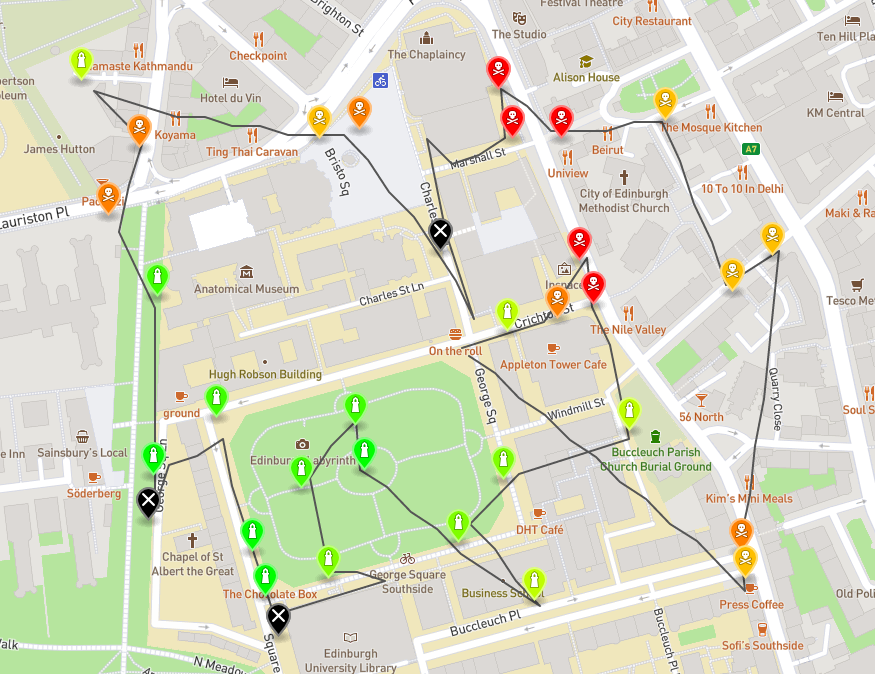
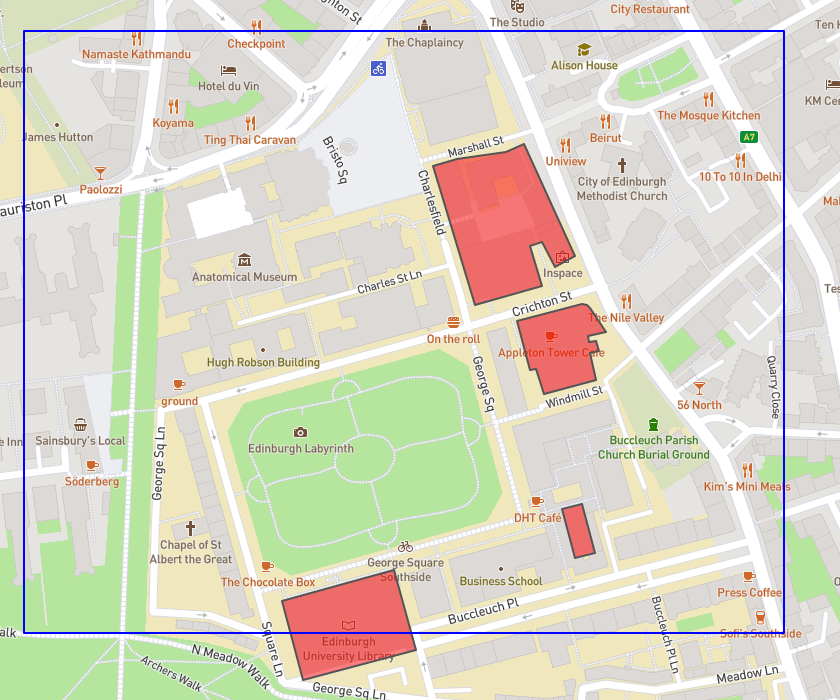

# Informatics Large Practical CW2

This is the main coursework of the practical. The task was to creat a program that would connect to a webserver to download today's sensors locations, forbidden areas and have a drone navigate around the map to read the sensors avoiding any obstacles.

There are some constraints in the sense that the drone is allowed to only move at a fixed distance every step. All angles moved should be multiples of 10. The drone was confined within a limited area. The drone was not allowed to read a sensor without moving first. There were buildings to avoid. And finally, the drone had to read all 33 sensors of a single day and go back within 150 moves.

For this I utilise the mapboxsdk for handling and parsing geolocational data as well as the JGraphT library which was used for the obstacle avoiding part of the drone. Once again the project was written in Java 11.

The program outputs 2 different files for every day:
- flightpath-dd-mm-yyyy.txt
- readings-01-01-2020.geojson

Every line of the flightpath file contains:

- The step number
- Staring position
- Angle moved
- Final position
- If a sensor was read its W3W position.

The readings file contains a geojson that is madeup of a linestring which shows the path followed by the drone, and the sensors read categorized by color with the appropriate label.

The program takes the standard input arguments: DD MM YYYY Latitude longitude Seed Port.

Here is a rendered geojson output:

The areas that the drone needed to avoid:

The green markers represent a healthy air quality value. The reading values can go from healthy to bad which is represented as red. The black markers are the sensors that were found to have low battery or an unreliable reading. All sensor's positions were given in the form of a What 3 Words representation which was also downloaded from the server.

**Since the course is now over we were allowed to publish our repositories.**
